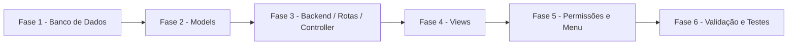

# Plano de Ação - Módulo Financeiro

**Baseado em:** [MODULO_FINANCEIRO.md](MODULO_FINANCEIRO.md)
**Data:** 27 de julho de 2026
**Status:** Executado (Fases 1 a 6 concluídas)

---

## 🎯 Contexto e Stack

- Backend: Laravel (padrão atual do projeto)
- Frontend: Blade + JS existente (AdminLTE, DataTables — mesmo padrão de `clientes`/`processos`)
- Banco: MySQL (Laradock)
- Reuso de models existentes: `Cliente`, `Processo`
- Novo model: `Financeiro` + pivot `financeiro_processo`

---

## 🗺️ Visão Geral das Fases

---

## Fase 1 — Banco de Dados

- [x] T001 Criar migration `create_financeiros_table` (`cliente_id`, `valor_causa`, `honorarios`, `reembolso`, `data_pagamento`, `status_pagamento`, `observacoes`, timestamps)
- [x] T002 Criar migration `create_financeiro_processo_table` (pivot N:N `financeiro_id` x `processo_id`, unique composto)
- [x] T003 Rodar migrations em ambiente local (MySQL via Laradock) e validar estrutura das tabelas
- [ ] T004 Criar seeder/factory `FinanceiroFactory` para dados de teste (não implementado — opcional, fora do MVP)

## Fase 2 — Models

- [x] T101 Criar `app/Models/Financeiro.php` com `fillable`, `casts` (decimais e data) e relação `belongsTo(Cliente::class)`
- [x] T102 Adicionar relação `belongsToMany(Processo::class, 'financeiro_processo', ...)` no model `Financeiro`
- [x] T103 Adicionar relação `financeiros()` (`hasMany`) em `app/Models/Cliente.php`
- [x] T104 Adicionar relação `financeiros()` (`belongsToMany`) em `app/Models/Processo.php`
- [x] T105 Implementar accessor `status_pagamento_label` (Em dia / Atrasado / Quitado) no model `Financeiro`

## Fase 3 — Backend (Rotas, Controller, Validação)

- [x] T201 Criar `app/Http/Controllers/FinanceiroController.php` (index, incluir, alterar, excluir)
- [x] T202 Registrar rotas em `routes/web.php`: `financeiro`, `incluir-financeiro`, `alterar-financeiro`, `excluir-financeiro`
- [x] T203 Criar `StoreFinanceiroRequest`/`UpdateFinanceiroRequest` com validações:
  - `cliente_id` obrigatório e existente
  - `valor_causa` obrigatório, numérico, > 0
  - `honorarios`/`reembolso` numérico, >= 0, opcional
  - `status_pagamento` obrigatório, `in:em_dia,atrasado,quitado`
  - `data_pagamento` obrigatória quando `status_pagamento = quitado`
  - `processos` (array) obrigatório com pelo menos 1 item
- [x] T204 Implementar regra de negócio: validar que todos os `processos` enviados pertencem ao `cliente_id` informado (rejeitar caso contrário)
- [x] T205 Implementar endpoint AJAX `GET /api/processos/search` (novo `apiSearch` em `ProcessosController`, filtrável por `cliente_id`) para popular o multi-select dependente
- [x] T206 Implementar filtros na listagem (`cliente_id`, `numero_processo`, `status_pagamento`)
- [ ] T207 Criar `Policy` (`FinanceiroPolicy`) — não implementado; controle de acesso feito via middleware `afterAuth:financeiro` (mesmo padrão de `clientes`/`perfis`), consistente com o restante do projeto

## Fase 4 — Views

- [x] T301 Criar `resources/views/financeiro.blade.php` (listagem com filtros por cliente/nº processo/status)
- [x] T302 Tela de criação/edição incluída no mesmo arquivo `financeiro.blade.php` (tela `incluir`/`alterar`), seguindo o padrão já usado em `tipos-acao.blade.php`/`processos.blade.php` (sem arquivo separado em `formularios/`)
- [x] T303 Implementar select de cliente (Select2 AJAX) + multi-select de processos dependente do cliente (Select2 AJAX reinicializado no `change` do cliente)
- [x] T304 Campos monetários com `input type="number" step="0.01"` (sem máscara JS adicional, evitando nova dependência)
- [x] T305 Adicionar badge colorido por status (`Em dia` verde, `Atrasado` vermelho, `Quitado` azul)
- [x] T306 Adicionar botão "Financeiro do cliente" na tela de alteração de cliente (`clientes.blade.php`)

## Fase 5 — Permissões e Menu

- [x] T401 Criar migration para adicionar submenu "Financeiro" em `menus`/`submenus` (menu "Controles", junto de Processos/Andamentos/Documentos)
- [x] T402 Adicionar permissões do novo submenu aos perfis que já possuem acesso a Processos (com fallback para perfil 1)
- [x] T403 Validado via `tinker`: submenu `financeiro` criado (`menu_id=2`) e permissão `perfil_submenu` gerada para o perfil 1

## Fase 6 — Validação e Testes

- [x] T501/T502 Cobertos pelo teste automatizado `test_lancamento_pode_ser_criado_vinculado_a_multiplos_processos_do_mesmo_cliente`
- [x] T503 Coberto pelo teste `test_nao_permite_vincular_processo_de_outro_cliente`
- [x] T504 Coberto pelo teste `test_status_quitado_exige_data_de_pagamento`
- [x] T505 Coberto pelo teste `test_lancamento_pode_ser_editado_e_excluido` (edição de status + exclusão)
- [x] T506 Criado `tests/Feature/FinanceiroCrudTest.php` com os 4 cenários acima — **4 passed**
- [x] T507 Suíte completa executada (`php artisan test`): sem regressões causadas pelo módulo Financeiro. Restam 2 falhas pré-existentes em `AndamentosOwnershipTest` (rota `/andamentos` já removida do projeto, não relacionada a este módulo)

---

## ⚠️ Riscos e Mitigação

| Risco | Mitigação |
|---|---|
| Vínculo indevido entre processo e cliente diferente | Validação obrigatória no backend (T204), nunca confiar apenas no frontend |
| Inconsistência de status x data de pagamento | Regra de validação cruzada no `FormRequest` (T203) |
| Impacto em telas existentes de cliente/processo | Botões de acesso apenas adicionam link (T306), sem alterar fluxo atual |
| Falta de permissão configurada | Task dedicada de menu/permissão (Fase 5) antes de liberar para usuários |

---

## ✅ Critérios de Conclusão

- Todas as tasks das Fases 1 a 6 concluídas
- CRUD completo do módulo Financeiro funcional
- Vínculo N:N com processos restrito ao mesmo cliente, validado no backend
- Filtro por status (Em dia / Atrasado / Quitado) funcionando na listagem
- Sem regressão nas telas de `clientes` e `processos`

---

## 📝 Notas de Execução

- Migrations testadas com sucesso tanto no SQLite (suíte de testes) quanto no MySQL real do Laradock (`php artisan migrate`).
- Corrigido bug pré-existente na migration `2026_04_28_alter_andamentos_tipo_to_varchar.php`: o `ALTER TABLE ... MODIFY` é exclusivo do MySQL e quebrava toda a suíte de testes em SQLite. A migration agora só executa esse `ALTER` quando o driver ativo é `mysql`.
- Diretórios de runtime ausentes (`storage/framework/views`, `storage/framework/cache/data`, `storage/framework/sessions`) foram recriados no container do workspace — ambiente local não tinha essas pastas, o que quebrava qualquer teste que renderizasse views Blade.
- Arquivos novos: 4 migrations, `app/Models/Financeiro.php`, `StoreFinanceiroRequest`/`UpdateFinanceiroRequest`, `FinanceiroController`, `resources/views/financeiro.blade.php`, `tests/Feature/FinanceiroCrudTest.php`. Arquivos alterados: `Cliente.php`, `Processo.php`, `ProcessosController.php` (novo `apiSearch`), `routes/web.php`, `clientes.blade.php` (link "Financeiro do cliente").

