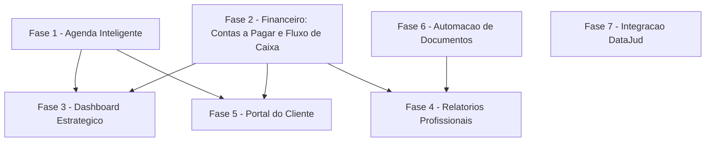

# Plano de Ação — Novas Funcionalidades

**Baseado em:** [database/analise-funcionalidades-faltantes.md](database/analise-funcionalidades-faltantes.md) (gap entre [database/refatoração.md](database/refatoração.md) e o código atual)
**Data:** 15 de setembro de 2026
**Status:** Fases 1 (Agenda), 2.1–2.3 (Contas a Pagar, Fluxo de Caixa, Inadimplência), 3 (Dashboard), 4 (Relatórios), 5 (Portal do Cliente) e 6 (Automação de Documentos) implementadas e testadas. Fase 2.4 (WhatsApp) e Fase 7 (DataJud) em planejamento.

---

## 🎯 Contexto e Stack

- Backend: Laravel (padrão atual do projeto)
- Frontend: Blade + AdminLTE + DataTables + Select2 (mesmo padrão de `clientes`/`processos`/`financeiro`)
- Banco: MySQL (Laradock)
- Convenção de código: controllers `index/incluir/alterar/desativar/excluir` + `FormRequest` de validação + rota `afterAuth:<slug>` + submenu/permissão via migration (ver `PLANO_ACAO_MODULO_FINANCEIRO.md` como referência de padrão já aplicado)
- Módulos hoje **inexistentes**: Agenda, Portal do Cliente, Automação de Documentos, integração DataJud, cobrança via WhatsApp, relatórios reais (PDF/Excel), gráficos

---

## 🗺️ Visão Geral e Ordem de Execução

A ordem não é a mesma do documento de vendas — segue dependência técnica (o que outros módulos consomem primeiro):

| Fase | Módulo | Depende de | Prioridade | Esforço estimado |
|---|---|---|---|---|
| 1 | Agenda Inteligente | — | Alta | 5-7 dias |
| 2 | Financeiro (contas a pagar, fluxo de caixa, cobrança WhatsApp) | — | Alta | 8-10 dias |
| 3 | Dashboard Estratégico (gráficos + indicadores) | Fases 1 e 2 | Média | 3-4 dias |
| 4 | Relatórios Profissionais (PDF real + Excel) | Fase 2 (dados) | Média | 4-5 dias |
| 5 | Portal do Cliente | Fases 1 e 2 | Alta (diferencial comercial) | 8-10 dias |
| 6 | Automação de Documentos (modelos/editor/geração) | — | Média | 6-8 dias |
| 7 | Integração DataJud | — | Baixa (depende de acesso externo/CNJ) | 5-7 dias |

**Total estimado: 39-51 dias úteis.** Fases 1, 2, 6 e 7 podem correr em paralelo por serem independentes entre si; 3, 4 e 5 só começam depois de suas dependências.

---

## Fase 1 — Agenda Inteligente ✅ Implementada

Hoje não existe nenhuma tabela de compromissos/prazos — `Andamento` é só histórico passado.

### 1.1 Banco de Dados
- [x] T001 Migration `create_compromissos_table`: `titulo`, `tipo` (audiencia, prazo_fatal, reuniao, outro), `data_hora`, `processo_id` (nullable, FK), `responsavel_id` (FK `users`), `status` (pendente, concluido, cancelado), `observacoes`, timestamps
- [x] T002 Índice em `data_hora` para consultas de agenda (FK `processo_id` já indexada pela constraint)
- [x] T003 Migration validada via SQLite (suíte de testes, `RefreshDatabase`). **Pendente:** validar `php artisan migrate` no MySQL real do Laradock antes de subir para produção — não executado nesta sessão porque o container Laradock ativo na máquina está apontando para outro projeto (`rehabcloud`)

### 1.2 Model
- [x] T004 Criado `app/Models/Compromisso.php` com `fillable`, `casts` (`data_hora` datetime) e consts `STATUS_OPTIONS`/`TIPO_OPTIONS`
- [x] T005 Relações `belongsTo(Processo::class)`, `belongsTo(User::class, 'responsavel_id')` e `belongsTo(User::class, 'created_by')`
- [x] T006 Scope `proximos()` (status pendente, `data_hora >= agora`, ordenado)
- [x] T007 Scope `vencidos()` (status pendente com `data_hora < agora`) — cobre também prazo fatal, já que o filtro é por status/data, não por tipo
- [x] T008 Relação `compromissos()` (`hasMany`) adicionada em `app/Models/Processo.php`

### 1.3 Backend
- [x] T009 Criado `app/Http/Controllers/CompromissosController.php` (index, incluir, alterar, concluir, excluir, feed)
- [x] T010 `StoreCompromissoRequest`/`UpdateCompromissoRequest` (validam `data_hora`, `processo_id`/`responsavel_id` existentes, `tipo`/`status` dentro do enum)
- [x] T011 Endpoint `GET /api/compromissos/feed` (JSON no formato esperado pelo FullCalendar — `id`/`title`/`start`/`color`, filtrável por `start`/`end`)
- [x] T012 Rotas em `routes/web.php` (`agenda`, `incluir-agenda`, `alterar-agenda`, `concluir-agenda`, `excluir-agenda`) com `afterAuth:agenda`

### 1.4 Views
- [x] T013 `resources/views/agenda.blade.php` com calendário FullCalendar v6 (**usando o bundle já vendorizado em `public/js/fullcalendar`, sem CDN nova** — locale pt-br incluído) + lista lateral de "próximos compromissos" com filtros de status/tipo
- [x] T014 Modal de criação/edição de compromisso reaproveitável (`resources/views/formularios/agendaCompromissoFormulario.blade.php`), no mesmo padrão Bootstrap 4 dos modais de andamento
- [x] T015 Card "Agenda do Processo" + botão "Novo Compromisso" na tela de processo (`processos.blade.php`), pré-preenchendo `processo_id` via modal dedicado
- [ ] T016 Badge de contagem de prazos vencidos no menu lateral — **não implementado**: o menu lateral (`layouts.navbar_left`) é só um placeholder; a renderização real do menu é feita em outro ponto do projeto (fora do escopo desta fase) e precisa ser localizada antes de expor esse contador

### 1.5 Permissões e Menu
- [x] T017 Migration `2026_09_15_000002_add_agenda_submenu.php` adicionando submenu "Agenda" (mesmo padrão de `add_tipos_acao_submenu`/`add_financeiro_submenu`)
- [x] T018 Migration `2026_09_15_000003_add_agenda_to_processos_profiles.php` vinculando permissão aos perfis com acesso a Processos

### 1.6 Testes
- [x] T019 Teste: criação de compromisso vinculado a processo (`AgendaCrudTest::test_compromisso_pode_ser_criado_vinculado_a_processo`)
- [x] T020 Teste: scope `vencidos()` retorna apenas pendentes expirados, excluindo concluídos e futuros
- [x] T021 Teste: feed da API retorna JSON no formato esperado
- [x] T022 (extra) Testes de validação obrigatória (`titulo`/`data_hora`), conclusão de compromisso e smoke test de renderização das views `agenda.blade.php` e do card novo em `processos.blade.php`

**Arquivos novos:** 3 migrations, `app/Models/Compromisso.php`, `StoreCompromissoRequest`/`UpdateCompromissoRequest`, `CompromissosController`, `resources/views/agenda.blade.php`, `resources/views/formularios/agendaCompromissoFormulario.blade.php`, `tests/Feature/AgendaCrudTest.php` (7 testes).
**Arquivos alterados:** `Processo.php` (relação `compromissos()`), `ProcessosController.php` (eager load `compromissos.responsavel` no `alterar()`), `routes/web.php`, `processos.blade.php` (card + modal + JS de novo compromisso).
**Suíte completa:** `php artisan test` → 29 passed, 2 failed (falhas pré-existentes em `AndamentosOwnershipTest`, não relacionadas — rota `/andamentos` já removida do projeto, mesmo problema documentado em `PLANO_ACAO_MODULO_FINANCEIRO.md`).

---

## Fase 2 — Financeiro: Contas a Pagar, Fluxo de Caixa e Cobrança via WhatsApp

Hoje `Financeiro` só modela valores **a receber** dos clientes. Faltam despesas do escritório, visão consolidada de caixa e cobrança automatizada.

**Status:** 2.1 a 2.3 implementadas e testadas nesta sessão. 2.4 (WhatsApp) segue bloqueada pela decisão de provedor — não iniciada.

### 2.1 Contas a Pagar (Despesas) ✅
- [x] T101 Migration `create_despesas_table`: `descricao`, `categoria`, `valor`, `valor_pago`, `data_vencimento`, `data_pagamento` (nullable), `status` (pendente/pago/atrasado), `filial_id` (nullable), timestamps
- [x] T102 Model `app/Models/Despesa.php` com `computeStatus()` (mesmo padrão de `Financeiro::computeStatus()`) + `Despesa::totalEmAtraso()` (helper estático reutilizável)
- [x] T103 `DespesasController` (index/incluir/alterar/excluir/pagar), `StoreDespesaRequest`/`UpdateDespesaRequest`
- [x] T104 Rotas + view `resources/views/despesas.blade.php` (mesmo padrão de `financeiro.blade.php`, sem parcelamento)
- [x] T105 Migrations de submenu "Contas a Pagar" + permissões (herdadas de quem já tem acesso a "Financeiro")

### 2.2 Fluxo de Caixa ✅
- [x] T106 Criado `RelatorioFinanceiroController@fluxoCaixa`: agrega `Financeiro` (à vista + parcelas pagas) e `Despesa` (pagas) por mês. **Agrupamento feito em PHP (Carbon), não via `DATE_FORMAT` do MySQL**, para manter a suíte de testes compatível com SQLite
- [x] T107 View `resources/views/relatorios/fluxo-caixa.blade.php` com cards de totais + tabela mês a mês (entradas, saídas, saldo) e filtro de período (3/6/12/24 meses)
- [x] T108 Rota `GET /relatorios/fluxo-caixa` (gated por `afterAuth:financeiro`)

### 2.3 Inadimplência ✅
- [x] T109 `RelatorioFinanceiroController@inadimplencia` + view `resources/views/relatorios/inadimplencia.blade.php`: lista `Financeiro` à vista vencido, `FinanceiroParcela` vencida e `Despesa` atrasada, unificados e ordenados por dias de atraso
- [x] T110 `Financeiro::totalEmAtraso()` e `Despesa::totalEmAtraso()` (helpers estáticos) — prontos para o Dashboard reaproveitar na Fase 3

### 2.4 Cobrança Automatizada via WhatsApp — não iniciada
- [ ] T111 Definir provedor (Z-API, WhatsApp Cloud API oficial da Meta, ou Twilio) — **decisão de negócio pendente**, impacta custo e prazo de aprovação de conta comercial
- [ ] T112 `app/Services/WhatsAppCobrancaService.php` (envio de mensagem via HTTP client do provedor escolhido)
- [ ] T113 Template de mensagem com placeholders (`{{nome}}`, `{{valor}}`, `{{vencimento}}`) — reaproveitar motor de merge que será criado na Fase 6, se antecipado
- [ ] T114 `app/Console/Commands/EnviarCobrancasVencidas.php` (Artisan command) + entrada no `routes/console.php`/scheduler para execução diária
- [ ] T115 Log de envios (nova tabela `cobrancas_enviadas` ou reaproveitar `AuditLog`) para evitar duplicidade e permitir auditoria
- [ ] T116 Tela de configuração de credenciais do provedor (token/API key) em `SettingsController`/`config/services.php`

### 2.5 Testes
- [x] T117 Teste: `Despesa::computeStatus()` retorna `atrasado` corretamente
- [x] T118 Teste: fluxo de caixa soma entradas e saídas do mês corretamente (`RelatorioFinanceiroTest::test_fluxo_de_caixa_soma_entradas_e_saidas_do_mes_corrente`)
- [ ] T119 Teste: command de cobrança não reenvia mensagem já enviada no mesmo dia (mock do serviço externo) — depende da Fase 2.4, não iniciada
- [x] (extra) `DespesasCrudTest` (5 testes: criação, cálculo de status atrasado, pagamento, `totalEmAtraso()`, smoke da view) e `RelatorioFinanceiroTest` (3 testes: fluxo de caixa, inadimplência ordenada por dias de atraso, `Financeiro::totalEmAtraso()`)

**Arquivos novos:** 3 migrations (`despesas` + submenu + permissão), `app/Models/Despesa.php`, `StoreDespesaRequest`/`UpdateDespesaRequest`, `DespesasController`, `RelatorioFinanceiroController`, `resources/views/despesas.blade.php`, `resources/views/relatorios/fluxo-caixa.blade.php`, `resources/views/relatorios/inadimplencia.blade.php`, `tests/Feature/DespesasCrudTest.php`, `tests/Feature/RelatorioFinanceiroTest.php`.
**Arquivos alterados:** `app/Models/Financeiro.php` (`totalEmAtraso()`), `routes/web.php`, `resources/views/financeiro.blade.php` (botões de acesso a Contas a Pagar/Fluxo de Caixa/Inadimplência).
**Suíte completa:** `php artisan test` → 37 passed, 2 failed (as mesmas 2 falhas pré-existentes de `AndamentosOwnershipTest`, sem relação com esta fase).
**Migrations aplicadas no MySQL real** (Laradock, `php artisan migrate --force`) — validado tanto em SQLite (testes) quanto em MySQL.
**Nota operacional:** o container `laradock-workspace-1` mantinha uma view Blade compilada e desatualizada de `processos.blade.php` (de antes da Fase 1), o que quebrou um teste só quando a suíte completa rodava. Resolvido com `php artisan view:clear`. Se algo parecido acontecer de novo — teste passa isolado mas falha na suíte completa por causa de HTML/conteúdo ausente — rodar `view:clear` antes de investigar mais a fundo.

---

## Fase 3 — Dashboard Estratégico ✅ Implementada

Depende das Fases 1 (próximos prazos) e 2 (indicadores financeiros).

- [x] T201 Adicionada biblioteca de gráficos (**Chart.js 4.4.4 via CDN jsdelivr**, versão fixa — não havia Chart.js vendorizado localmente, só um script de app de outro projeto que já usava a mesma API)
- [x] T202 `HomeController@index`: incluídos KPIs financeiros (`a_receber_pendente`, `recebido_mes`, `total_receber_atraso`, `total_pagar_atraso` — reaproveitando `Financeiro::totalEmAtraso()`/`Despesa::totalEmAtraso()` da Fase 2) e `proximosCompromissos` (reaproveitando `Compromisso::proximos()`)
- [x] T203 Gráfico "Processos por status" (doughnut) alimentado por `Processo::selectRaw('status, count(*)...')`
- [x] T204 Gráfico "Entradas x Saídas" dos últimos 6 meses — **extraído `app/Services/FluxoCaixaCalculator.php`** a partir do código que estava duplicado no `RelatorioFinanceiroController`, agora reaproveitado por ambos (relatório e dashboard)
- [x] T205 Widget "Próximos compromissos" (lista dos 5 mais próximos, com link para `/agenda`)
- [x] T206 `resources/views/home.blade.php` ajustado com 4 novos cards financeiros, 2 gráficos (canvas + Chart.js) e o widget de compromissos — mantendo intactos os elementos já cobertos por testes existentes ("Dashboard Jurídico", "Acesso rápido - Consulta de processos")

### Testes
- [x] T207 Teste: `HomeController@index` renderiza os novos KPIs sem erro em instalação nova, sem nenhum dado financeiro/compromisso cadastrado (`test_dashboard_renders_financial_kpis_on_fresh_install_without_data`)
- [x] (extra) Teste com dados reais validando os valores exibidos nos cards e no widget de compromissos (`test_dashboard_shows_financial_kpis_and_proximos_compromissos_com_dados`)

**Arquivos novos:** `app/Services/FluxoCaixaCalculator.php`.
**Arquivos alterados:** `app/Http/Controllers/HomeController.php`, `resources/views/home.blade.php`, `app/Http/Controllers/RelatorioFinanceiroController.php` (refatorado para usar o novo `FluxoCaixaCalculator` em vez de duplicar a agregação), `tests/Feature/HomeDashboardTest.php` (+2 testes).
**Suíte completa:** `php artisan test` → 39 passed, 2 failed (as mesmas 2 falhas pré-existentes, sem relação).

---

## Fase 4 — Relatórios Profissionais ✅ Implementada

Hoje `exportPrint()` só devolve uma view HTML para impressão do navegador; `maatwebsite/excel` está no `composer.json` e nunca é usado.

### 4.1 PDF Real com Identidade Visual
- [x] T301 Adicionado `barryvdh/laravel-dompdf` via composer — usada a versão `^3.1` (não `^2.0`, bloqueada pelo audit de segurança do composer por CVEs conhecidas no `dompdf/dompdf` 2.0.x)
- [x] T302 **Não foi necessário criar campo de logo em `Filial`/`Settings`**: o projeto já tinha um logo global único configurado em `config/adminlte.php` (`public/img/img_logo.png`), reaproveitado como timbre — criar um campo por filial seria escopo não pedido, já que o sistema hoje não é multi-tenant por escritório
- [x] T303 `ProcessosController@exportPrint` e `ClientesController@exportPrint` agora geram PDF real via novo helper `app/Support/PdfExporter.php` (usa `Pdf::loadView(...)->stream()`), com timbre (`resources/views/exports/_letterhead.blade.php`, logo em base64 + nome do escritório + data/hora de geração) incluído nas views `exports/processos-print.blade.php` e `exports/clientes-print.blade.php`
- [x] T304 `RelatorioFinanceiroController@exportarFluxoCaixaPdf` (view dedicada `relatorios/fluxo-caixa-pdf.blade.php`, com o mesmo timbre)

### 4.2 Exportação para Excel
- [x] T305 Implementadas as classes `Export` do Maatwebsite: `app/Exports/ProcessosExport.php`, `ClientesExport.php`, `FinanceiroExport.php` (a dependência já estava instalada em `vendor/`, só não tinha nenhum uso no código)
- [x] T306 Rotas `exportar-processos-xlsx`, `exportar-clientes-xlsx`, `exportar-financeiro-xlsx`
- [x] T307 Botões "Exportar Excel" adicionados em `processos.blade.php`, `clientes.blade.php` e `financeiro.blade.php`, ao lado dos botões de CSV/PDF já existentes

### 4.3 Gráficos Dinâmicos nos Relatórios
- [x] T308 Chart.js (mesmo CDN da Fase 3) reaproveitado no relatório de Fluxo de Caixa (`relatorios/fluxo-caixa.blade.php`) — gráfico de barras Entradas x Saídas antes da tabela, mais botão "Exportar PDF" do próprio relatório

### Testes
- [x] T309 Teste: rotas de exportação PDF retornam `Content-Type: application/pdf` e corpo iniciado por `%PDF-` (`ExportPdfTest` atualizado + novo teste em `RelatorioFinanceiroTest`)
- [x] T310 Teste: rotas de exportação Excel geram o arquivo esperado, validado via `Excel::fake()`/`Excel::assertDownloaded()` (`tests/Feature/ExportXlsxTest.php`, 3 testes)

**Nota:** os testes antigos de `/exportar-clientes-pdf` e `/exportar-processos-pdf` faziam `assertSee()` no HTML — isso deixou de funcionar porque a resposta agora é um PDF binário real, não HTML. Os testes foram atualizados para verificar `Content-Type: application/pdf` e a assinatura binária `%PDF-`, que é o comportamento correto esperado agora.

**Arquivos novos:** `app/Support/PdfExporter.php`, `app/Exports/{Processos,Clientes,Financeiro}Export.php`, `resources/views/exports/_letterhead.blade.php`, `resources/views/relatorios/fluxo-caixa-pdf.blade.php`, `tests/Feature/ExportXlsxTest.php`.
**Arquivos alterados:** `composer.json`/`composer.lock` (+ `barryvdh/laravel-dompdf`), `ProcessosController`, `ClientesController`, `FinanceiroController`, `RelatorioFinanceiroController`, `exports/processos-print.blade.php`, `exports/clientes-print.blade.php`, `relatorios/fluxo-caixa.blade.php`, `processos.blade.php`, `clientes.blade.php`, `financeiro.blade.php`, `routes/web.php`, `tests/Feature/ExportPdfTest.php`, `tests/Feature/RelatorioFinanceiroTest.php`.
**Suíte completa:** `php artisan test` → 43 passed, 2 failed (as mesmas 2 falhas pré-existentes, sem relação).

---

## Fase 5 — Portal Exclusivo do Cliente ✅ Implementada

Módulo que estava em 0%. Depende de Agenda (Fase 1, para audiências) e Financeiro (Fase 2/parcelas já existentes).

**Decisão de negócio tomada (estava pendente):** autenticação por **CPF + senha própria**, não por "código enviado por e-mail/SMS". Motivo: o projeto não tem nenhum canal de entrega configurado (e-mail transacional ou SMS) — a mesma limitação que já bloqueia a Fase 2.4 (WhatsApp). A senha é definida por um usuário interno (não há autoatendimento/cadastro pelo próprio cliente) e passada a ele verbalmente ou por outro canal já usado pelo escritório.

### 5.1 Autenticação do Cliente
- [x] T401 Guard `cliente` adicionado em `config/auth.php` (provider `eloquent` → `App\Models\Cliente`)
- [x] T402 Migration `add_password_to_clientes_table` (`password` nullable). `Cliente` agora estende `Illuminate\Foundation\Auth\User` (mesma classe base do model `User`) para ser Authenticatable. **Importante:** `password` foi deliberadamente **omitido de `$fillable`** — só pode ser alterado via `ClientesController::definirAcessoPortal`, nunca pelo formulário geral de cadastro de cliente
- [x] T403 `app/Http/Controllers/Portal/AuthController.php`: login por CPF (normalizado, comparando dígitos via `REPLACE` em SQL — portável entre MySQL/SQLite) + senha (`Hash::check`), com rate limiting básico (5 tentativas/minuto por IP+CPF via `RateLimiter`, sem exigir colunas novas de lockout)
- [x] T404 Middleware `auth:cliente` aplicado ao grupo autenticado de `routes/portal.php`; `App\Http\Middleware\Authenticate::redirectTo()` ajustado para mandar requisições não autenticadas em `/portal/*` para `portal.login` (em vez do login administrativo)

### 5.2 Área do Cliente
- [x] T405 `Portal\ProcessosController` — `index`/`show`, sempre filtrando via `$cliente->processos()` (a própria query de relacionamento já restringe ao dono; tentar acessar processo de outro cliente resulta em 404, não em dado vazado)
- [x] T406 `Portal\DocumentosController` — lista e serve (`preview`) apenas documentos com `shared_with_client = true` E `processo_id` dentro dos processos do cliente. **Esse é o primeiro uso real do campo `shared_with_client`**, que hoje existia no banco mas não tinha nenhum consumidor
- [x] T407 `Portal\FinanceiroController` — lista lançamentos e parcelas (pagas/pendentes) do cliente
- [x] T408 `Portal\AgendaController` — compromissos tipo `audiencia` dos processos do cliente (reaproveita `Compromisso` da Fase 1)
- [x] T409 Layout dedicado `resources/views/portal/layout.blade.php`: página HTML própria (não estende `adminlte::page`), mobile-first, Bootstrap 4.6.2 + Font Awesome já vendorizados no projeto — sem o menu/sidebar administrativo
- [x] T410 Views: `portal/login.blade.php`, `portal/dashboard.blade.php`, `portal/processos.blade.php`, `portal/processo-detalhe.blade.php`, `portal/documentos.blade.php`, `portal/financeiro.blade.php`, `portal/agenda.blade.php`

### 5.3 Rotas
- [x] T411 `routes/portal.php` criado e registrado em `app/Providers/RouteServiceProvider.php` (Laravel 9 não usa `bootstrap/app.php` para isso — o registro é feito no `RouteServiceProvider`, como as demais rotas)

### 5.4 Testes (`tests/Feature/PortalClienteTest.php`, 8 testes)
- [x] T412 Teste: cliente autenticado só vê seus próprios processos na listagem E recebe 404 ao tentar acessar diretamente o processo de outro cliente pela URL
- [x] T413 Teste: documento com `shared_with_client = false` não aparece para o cliente (mesmo estando no mesmo processo de um documento compartilhado)
- [x] T414 Teste: login falha corretamente com CPF inexistente e com senha inválida
- [x] (extra) Testes de: staff conseguir definir senha de acesso; bloqueio de definir senha sem CPF cadastrado; login com sucesso; redirecionamento de visitante não autenticado para `portal.login`

**Bugs pegos pelos próprios testes antes de ir para produção:**
1. `Cliente::create(['password' => ...])`/`->update(['password' => ...])` **silenciosamente não gravava a senha**, porque `password` não está em `$fillable` (decisão deliberada de segurança). Corrigido usando atribuição direta (`$cliente->password = ...; $cliente->save();`) tanto no controller quanto no helper de teste.
2. O teste de definir senha via staff só passou depois de replicar o mesmo `$this->withoutMiddleware(AfterAuthMiddleware::class)` já usado em `ClientesCrudTest` — a permissão fina de `afterAuth:clientes` não é seedada para o perfil 1 de forma confiável no ambiente de testes (SQLite), então a suíte inteira desse controller já segue esse padrão, não é algo específico desta fase.

**Arquivos novos:** migration `add_password_to_clientes_table`, `app/Http/Controllers/Portal/{Auth,Dashboard,Processos,Documentos,Financeiro,Agenda}Controller.php`, `routes/portal.php`, `resources/views/portal/*.blade.php` (7 views), `tests/Feature/PortalClienteTest.php`.
**Arquivos alterados:** `config/auth.php` (guard/provider `cliente`), `app/Models/Cliente.php` (Authenticatable), `app/Http/Middleware/Authenticate.php` (redirect por contexto), `app/Providers/RouteServiceProvider.php` (registra `routes/portal.php`), `app/Http/Controllers/ClientesController.php` (`definirAcessoPortal`), `resources/views/clientes.blade.php` (card "Acesso ao Portal do Cliente"), `routes/web.php`.
**Migration aplicada no MySQL real** (Laradock, `php artisan migrate --force`).
**Suíte completa:** `php artisan test` → 51 passed, 2 failed (as mesmas 2 falhas pré-existentes, sem relação).

---

## Fase 6 — Automação de Documentos ✅ Implementada

Hoje `DocumentosController` só faz upload de arquivo já pronto — não existe geração a partir de modelo.

- [x] T501 Migration `create_modelos_documento_table`: `nome`, `tipo` (contrato/peticao/outro), `corpo` (longText com placeholders), `ativo`, timestamps
- [x] T502 Model `ModeloDocumento` + `ModeloDocumentoController` (index/incluir/alterar/desativar, mesmo padrão CRUD simples de `TiposAcaoController`)
- [x] T503 Editor integrado: **TinyMCE 6 via CDN** (jsdelivr) no campo `corpo` da tela de cadastro/edição de modelo
- [x] T504 `app/Services/GeradorDocumentoService.php`: recebe `ModeloDocumento` + `Processo` (+ `Cliente` opcional, default o primeiro cliente do processo) e substitui 12 placeholders conhecidos (`{{cliente.nome}}`, `{{cliente.cpf}}`, `{{cliente.endereco}}` já monta o endereço completo, `{{processo.numero}}`, `{{processo.vara}}`, `{{escritorio.nome}}`, `{{data.hoje}}` etc.)
- [x] T505 `DocumentosController@gerarDeModelo`: gera o PDF real via `PdfExporter::bytes()` (novo método, reaproveitando o mesmo timbre da Fase 4.1), salva em disco pelo mesmo `resolveContextoPath()` já usado no upload manual, e cria um `Documento` com `origem = 'modelo'` e `modelo_documento_id` preenchido (migration `add_origem_to_documentos_table`) — vinculado ao processo correto, nunca a outro
- [x] T506 Botão "Gerar Documento" + modal na tela de processo (`processos.blade.php`), com seleção de modelo ativo e, se o processo tiver mais de um cliente, seleção de qual cliente usar nos placeholders. Documentos gerados aparecem na tabela de documentos do processo com um badge "Gerado"
- [x] T507 Migrations de submenu "Modelos de Documento" + permissões (herdadas de quem já tem acesso a "Documentos")

### Testes (`GeradorDocumentoTest.php` + `ModeloDocumentoCrudTest.php`, 6 testes)
- [x] T508 Teste: geração substitui corretamente todos os placeholders conhecidos, incluindo o endereço composto, e não deixa nenhum `{{` residual no resultado
- [x] T509 Teste: documento gerado via `/gerar-documento` é salvo com `origem = 'modelo'`, vinculado ao processo correto (nunca a outro processo criado no mesmo teste) e o PDF gravado em disco começa com a assinatura `%PDF-`
- [x] (extra) CRUD completo de `ModeloDocumento` (criar/atualizar/desativar/listar)

**Arquivos novos:** 4 migrations, `app/Models/ModeloDocumento.php`, `app/Http/Controllers/ModeloDocumentoController.php`, `app/Services/GeradorDocumentoService.php`, `resources/views/modelos-documento.blade.php`, `resources/views/documentos/gerado-pdf.blade.php`, `tests/Feature/{GeradorDocumentoTest,ModeloDocumentoCrudTest}.php`.
**Arquivos alterados:** `app/Models/Documento.php` (`origem`, `modelo_documento_id`, relação `modeloDocumento()`), `app/Http/Controllers/DocumentosController.php` (`gerarDeModelo`), `app/Http/Controllers/ProcessosController.php` (`modelosAtivos` na tela de alteração), `app/Support/PdfExporter.php` (novo método `bytes()`, sem quebrar o `stream()` existente), `resources/views/processos.blade.php` (botão + modal + badge "Gerado"), `routes/web.php`.
**Suíte completa:** `php artisan test` → 57 passed, 2 failed (as mesmas 2 falhas pré-existentes, sem relação).
**Migrations aplicadas no MySQL real** (Laradock, `php artisan migrate --force`).

---

## Fase 7 — Integração com DataJud

Nenhuma referência hoje no código. Depende de credencial de acesso à API pública do DataJud (CNJ) — **passo externo, fora do controle da equipe de desenvolvimento**.

- [ ] T601 Levantar/validar credenciais de acesso à API DataJud (chave pública documentada pelo CNJ)
- [ ] T602 `app/Services/DataJudService.php` (client HTTP, consulta por número de processo/tribunal)
- [ ] T603 Mapear resposta da API para o formato interno de `Andamento` (tipo, data, descrição)
- [ ] T604 Botão "Sincronizar com DataJud" na tela de processo (`processos.blade.php`), disparando `AndamentosController@sincronizarDataJud`
- [ ] T605 Job assíncrono (`SincronizarProcessoDataJud`) para não bloquear a requisição HTTP durante a consulta externa
- [ ] T606 Tratamento de rate limit / indisponibilidade da API (retry com backoff, mensagem amigável ao usuário)
- [ ] T607 Campo `datajud_sincronizado_em` em `Processo` para exibir "última sincronização"

### Testes
- [ ] T608 Teste: mapeamento de resposta mockada da API DataJud gera `Andamento` corretamente
- [ ] T609 Teste: falha da API externa não quebra a tela de processo (fallback gracioso)

---

## ⚠️ Riscos e Mitigação

| Risco | Impacto | Mitigação |
|---|---|---|
| Dependência de conta comercial de WhatsApp (Fase 2.4) aprovada por terceiro | Alto | Iniciar processo de aprovação com o provedor escolhido em paralelo ao desenvolvimento das demais fases |
| API do DataJud instável/rate-limited (Fase 7) | Médio | Job assíncrono + retry, nunca síncrono na tela do usuário |
| Guard `cliente` novo pode colidir com sessão/guard `web` existente (Fase 5) | Alto | Testar login simultâneo cliente + usuário interno em navegadores/sessões separadas antes de liberar |
| Exposição indevida de dados no Portal do Cliente | Alto | Toda query do namespace `Portal\*` deve filtrar explicitamente por `cliente_id` autenticado — nunca reaproveitar controllers administrativos |
| `shared_with_client` mal configurado por padrão (`true`) pode expor documento sensível no portal | Médio | Revisar valor padrão do campo antes de ativar Fase 5 em produção (ver decisão pendente no `ANALISE_ALTERACOES_FEATURES.md`, item 6.2) |
| Escopo grande (7 módulos) gerar concorrência de branches | Médio | Uma branch por fase, merge sequencial respeitando o grafo de dependências acima |

---

## ✅ Critérios de Conclusão (por fase)

- **Fase 1:** Compromissos podem ser criados/editados/concluídos, calendário exibe corretamente, prazos vencidos aparecem destacados
- **Fase 2:** Contas a pagar funcionando como CRUD completo, fluxo de caixa mensal correto, ao menos um provedor de WhatsApp enviando cobrança real em ambiente de homologação
- **Fase 3:** Dashboard exibe gráficos reais com dados do banco, sem quebrar em instalação nova (sem dados)
- **Fase 4:** PDF gerado no servidor com logo do escritório, Excel exportável em processos/clientes/financeiro
- **Fase 5:** Cliente autenticado via CPF vê apenas seus próprios processos/documentos compartilhados/parcelas/audiências
- **Fase 6:** Modelo de contrato/petição gera documento final preenchido e vinculado ao processo
- **Fase 7:** Sincronização com DataJud importa andamentos reais de um processo de teste

---

## 📝 Notas

- Este plano não reimplementa nada que já existe (ver [database/analise-funcionalidades-faltantes.md](database/analise-funcionalidades-faltantes.md) para o que já está pronto): CRUD de clientes/processos/andamentos/documentos, honorários parcelados, tipos de ação.
- Seguir o mesmo padrão de execução documentado em `PLANO_ACAO_MODULO_FINANCEIRO.md` (migrations → models → controller/rotas → views → permissões/menu → testes) para cada fase acima.
- Decisão de negócio já tomada: autenticação do Portal do Cliente por CPF + senha própria definida por um usuário interno (Fase 5.1) — ver justificativa na seção da Fase 5.
- Decisão de negócio ainda pendente: provedor de WhatsApp para cobrança automatizada (Fase 2.4). O valor padrão de `shared_with_client` não chegou a ser um bloqueio: o campo já nasce `true` por padrão (migration original) e a Fase 5 simplesmente passou a respeitá-lo no Portal — quem quiser ocultar um documento específico do cliente já pode desmarcar o campo na tela de documentos.
